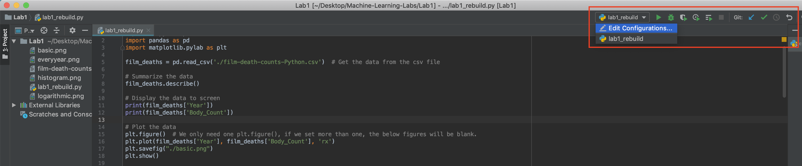
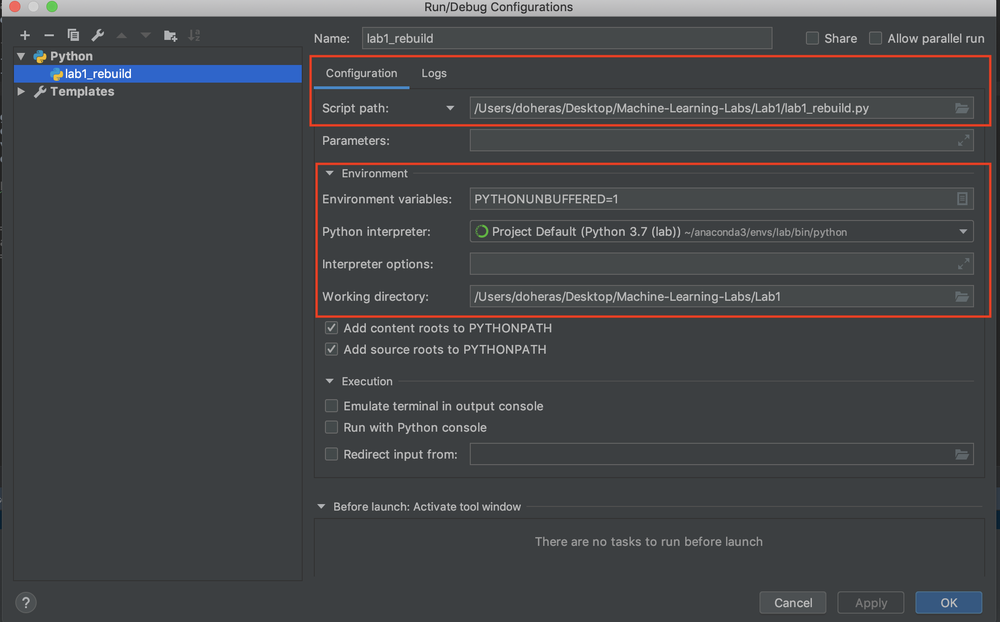

# Machine-Learning-Labs (University of Sheffield)


**Machine Learning and Adaptive Intelligence's Lab Notebook** 
=========================
[](). [](). 

Menu:
=========================
[TOC]


Description:
=========================
- This repository concludes the Ideas and Thoughts on the core knowledge of **Machine Learning and Adaptive Intelligence** which is based on the relative core class in University of Sheffield and self-study notes.
- For the course and reference‘s details, readers can find the **NOT ONLY** the knowledge of machine learning and adaptive intelligence **BUT ALSO** the way of building the correlative python program by famous libraries such as `Numpy`,`pandas`, mat.


Configure Python Compiling Environment
==============================
I really recommend the new learner to use the `Pycharm` as the IDE(Integrated Development Environment) and `Anaconda3` to manage the python library and packages.

You can download the correct Anaconda3 import setting file from the `./Ananconda_Setting` and follow the below instructions to install the correct 

### How to set the correct Python environment in Anaconda3
1.Download all the repository files from the `Github.com`.

```sh
$ git clone https://github.com/DoHerasYang/Machine-Learning-Labs.git
```
2.Download the [Anaconda3](https://www.anaconda.com/distribution/#download-section) and [Pycharm](https://www.jetbrains.com/pycharm/download/#section=mac) in your computer.

3.Move to the directory where the `lab.yml` and `requirement.txt` are, and install the library by these configuration file.

```sh
$ conda env create -f lab.yml
$ pip install -r requirement.txt
```
4.If you wish to use the `Terminal` to RUN the programs, you can activate the python env by these commands.

```sh
$conda env list #list all the
$source activate lab #only for Linux/Mac
#for windows use: activate lab
(lab)$... #You can run the program now by typing the command in terminal
``` 
### How to set the correct Python environment in Pycharm by relying on the Anaconda Environment
1.Open the repository folder by Pycharm, and Click `Edit Configuration`

2.Set the `Script path` as your current open file.
&emsp;Choose the `lab` as `Python interpreter`.



