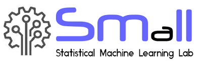

# Machine-Learning-Labs (University of Sheffield)



**Machine Learning and Adaptive Intelligence's Lab Notebook** 
=========================
[](). [](). 

Description:
=========================
- This repository concludes the Ideas and Thoughts on the core knowledge of **Machine Learning and Adaptive Intelligence** which is based on the relative core class in University of Sheffield and self-study notes.
- For the course and reference‘s details, readers can find the NOT ONLY the **knowledge of machine learning and adaptive intelligence** but also the way of building the correlative python program.


Lab Compiling Environment
==============================
I really recommend the new learner to use the `Pycharm` as the IDE(Integrated Development Environment) and `Anaconda3` to manage the python library and packages.

You can download the correct Anaconda3 setting from the `./Ananconda_Setting/lab.zip`

####How to set the correct Python environment

```sh
$ git clone https://github.com/DoHerasYang/Machine-Learning-Labs.git
```

